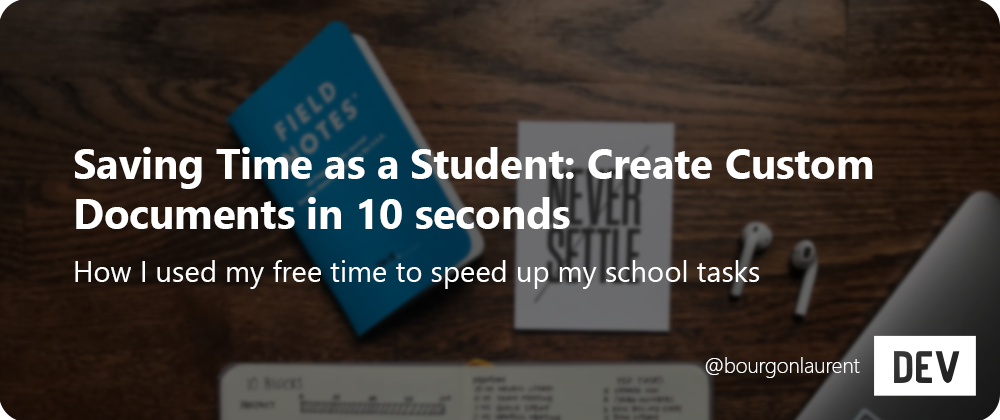
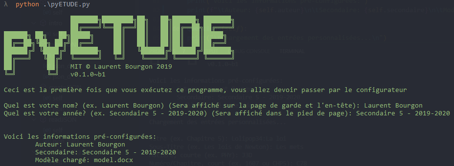
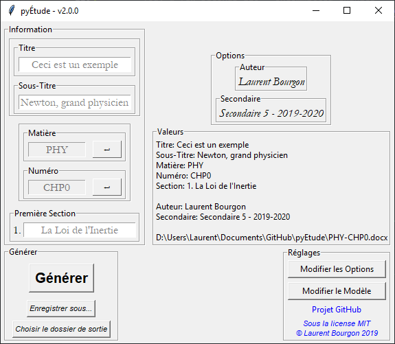
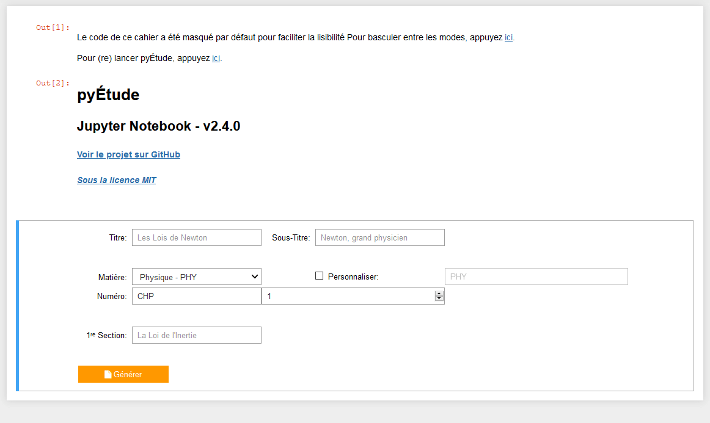
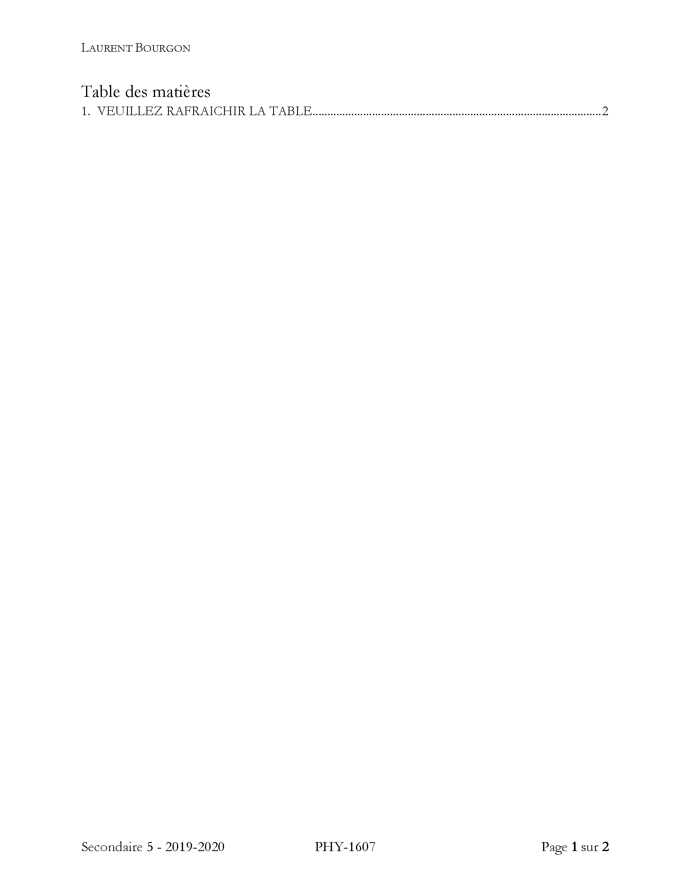
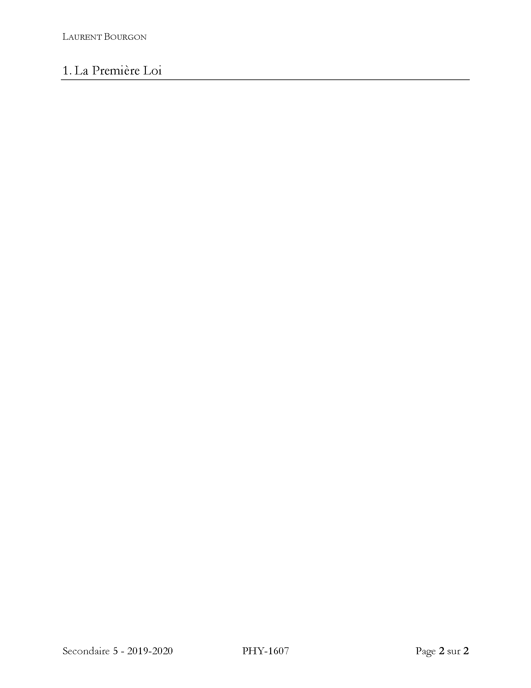
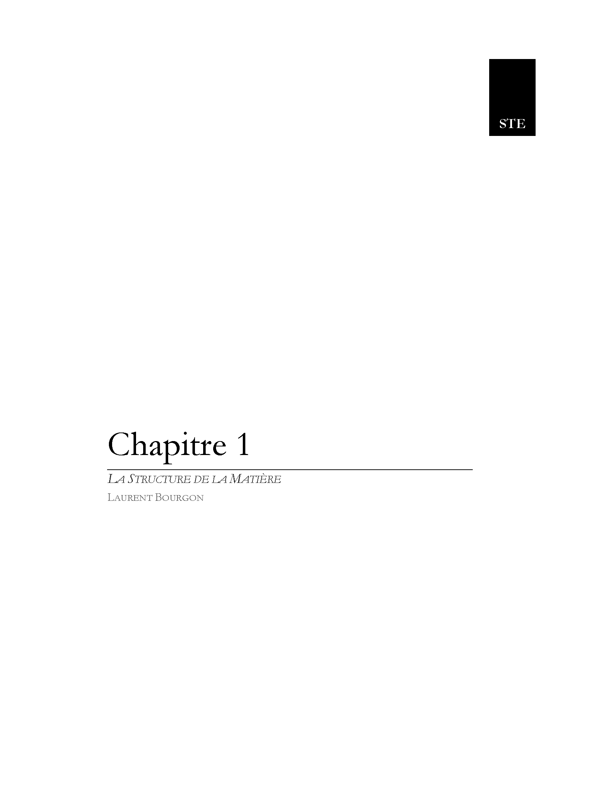
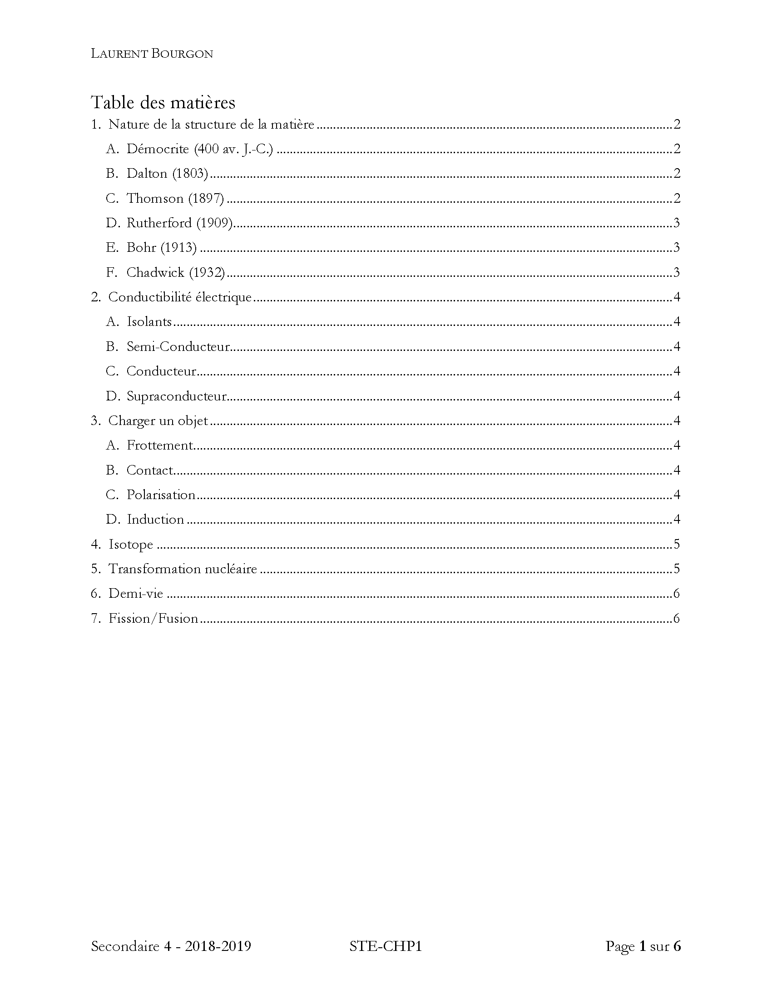
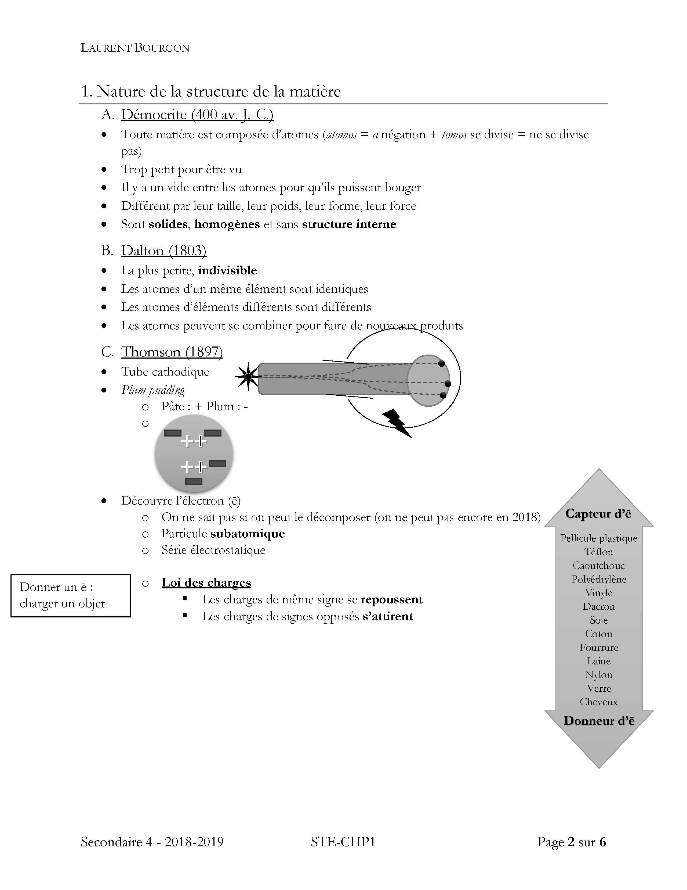
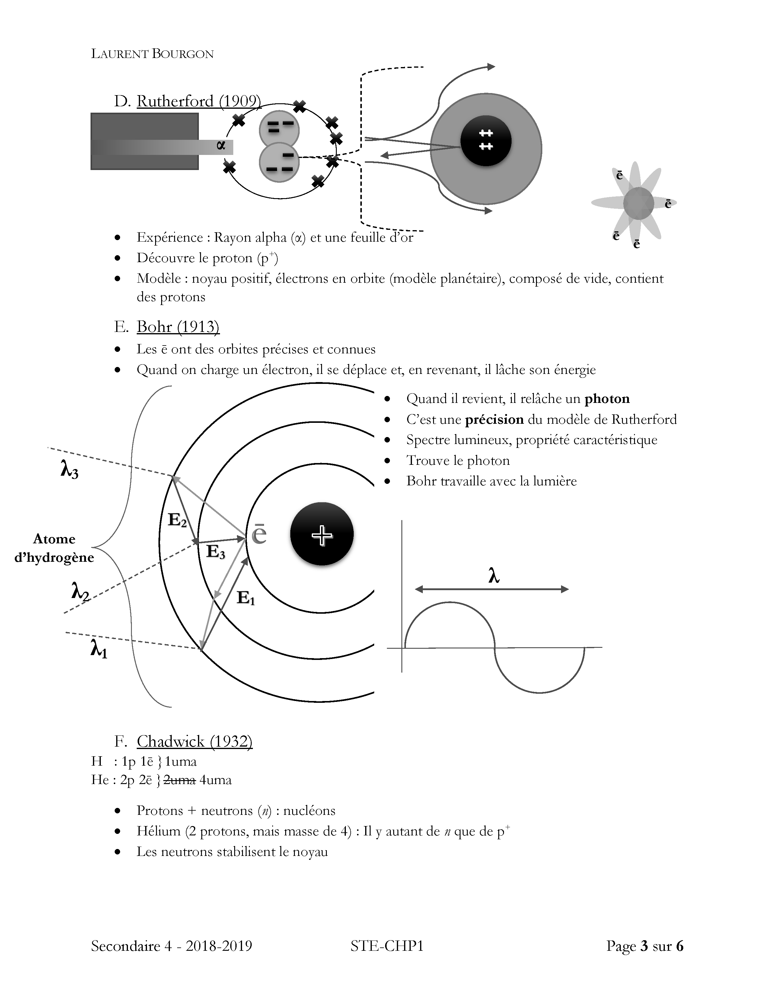

<div align="center">

  [](https://dev.to/bourgonlaurent/saving-time-as-a-student-create-custom-documents-in-10-seconds-4hea)

</div>

---

                     ███████╗████████╗██╗   ██╗██████╗ ███████╗
                     ██╔════╝╚══██╔══╝██║   ██║██╔══██╗██╔════╝
    ██████╗ ██╗   ██╗█████╗     ██║   ██║   ██║██║  ██║█████╗  
    ██╔══██╗╚██╗ ██╔╝██╔══╝     ██║   ██║   ██║██║  ██║██╔══╝  
    ██████╔╝ ╚████╔╝ ███████╗   ██║   ╚██████╔╝██████╔╝███████╗
    ██╔═══╝   ╚██╔╝  ╚══════╝   ╚═╝    ╚═════╝ ╚═════╝ ╚══════╝
    ██║        ██║   MIT © Laurent Bourgon 2020
    ╚═╝        ╚═╝   
    Ce document est relatif à la version v2.4.0

<div align="center">

  [](https://github.com/BourgonLaurent/pyEtude/releases) [](https://www.python.org/) [](LICENSE)

  [](https://img.shields.io/github/issues/BourgonLaurent/pyEtude/issues) [](https://github.com/BourgonLaurent/pyEtude/pulls)

</div>

---

## 📝 Table des Matières

- [Problème encontré](#probleme)
- [Solution](#solution)
- [Ce qu'il faut et les limites du projet](#limites)
- [Avenir](#avenir)
- [Bien Démarrer](#démarrer)
  - [Configuration requise](#configuration)
  - [Installation](#installation)
- [Utilisation](#utilisation)
- [Captures d'écran](#screenshots)
  - [pyÉtude](#pyEtude)
  - [pyÉtude-notebook](#notebook)
  - [Résultats](#resultats)
  - [Exemple Réel](#exemple_reel)
- [Foire Aux Questions](#faq)
- [Créé avec](#créé)
- [Contributeurs](#contrib)
- [Licence](#licence)
<!--- [Reconnaissances](#recon) -->

## 🧐 Problème encontré<a name="probleme"></a>

La création d'un document de révision est un outil majeur à l'apprentissage de nouveaux concepts, que ce soit au profil académique ou pour un loisir. Dans un monde idéal, nous n'aurions qu'à taper les informations et cela nous aiderait à les mémoriser. Cependant, les outils de traitement de texte ne permettent pas une telle facilité. Afin d'avoir un document potable pour l'étudier, il faut un modèle précis qui permet l'organisation de sujets peu importe leur champ. La création d'un tel document prend beaucoup de temps et, malheureusement, `Microsoft Word` ne permet aucun moyen efficace pour réutiliser ce modèle (les fichiers modèles `.dotx` ont beaucoup de problèmes). Ce problème réduit le temps qui peut être utilisé au remplissage du document.

Pour régler ce problème, j'ai commencé un projet qui permet de remplir un document modèle en quelques secondes et ce, sans problème de formattage.

## 💡 Solution<a name="solution"></a>

Afin de remplir ce document facilement, le programme va faire ceci:

1. Extraire le fichier modèle dans un dossier temporaire
2. Remplacer les informations par ce qui a été demandé au niveau du GUI
    - Le programme remplacera des valeurs dans les fichiers `.xml` du document `Word`.
3. Zipper et compresser le dossier temporaire de manière à ce que les normes et spécifications de `Microsoft Word` soient respectées (indispensable au bon fonctionnement du document dans l'avenir)
4. Détruire le dossier temporaire
5. Renommer l'extension du fichier créé pour qu'il soit reconnu par `Microsoft Word`

## ⛓️ Ce qu'il faut et les limites du projet<a name="limites"></a>

- Ce problème nécessite (pour l'instant) [`Python3`](https://www.python.org/downloads/). À cause de l'ajout d'un GUI, `pyÉtude` ne fonctionne que sous Windows, macOS et Linux (pour l'instant). Pour les autres périphériques, veuillez utiliser la version (obsolète) qui est en ligne de commande (`pyETUDE_cli.py`)
- Ce projet utilise un document `Word` manuellement configuré et le modifie à l'intérieur. Pour avoir un modèle différent, il faut modifier ce document avec les bonnes balises.
- Ce projet n'utilise pas le module `python-docx` puisqu'il était trop compliqué d'avoir un résultat correct et sans problème. De plus, cela enlève un élément à télécharger.

## 🚀 Avenir<a name="avenir"></a>

- [x] Transformer ce programme en GUI pour une utilisation plus facile et rapide
- [x] Fonctionner sous `Word on iOS/iPadOS` et `LibreOffice` (logiciels qui ne prennent pas en charge les métadonnées)
- [x] Mettre en place des chemins de sortie personnalisés selon la matière sélectionnée
- [x] Télécharger le modèle à distance afin de ne faire qu'un seul fichier à télécharger manuellement
- [x] Mode sombre (pour le bien des yeux!)
- [x] Matières Intelligentes qui savent quel document créé selon ceux qui ont déjà été créés
- [x] Transformer ce programme en interface web pour faciliter la tâche (depuis la version `2.4.0`, il existe une version en `Jupyter Notebook`)
- [x] Avoir un configurateur de modèles afin de créer un modèle personnalisé
- [x] Avoir plusieurs modèles qui peuvent être choisis.
- [x] Avoir plusieurs types de documents (page de présentation, devoirs, etc)
- [ ] Utiliser Qt for Python au lieu de PyQt5
- [ ] Ajout dans [PyPI](https://pypi.org/) afin de pouvoir le télécharger avec une simple commande (ex. `pip install pyEtude`)
- [ ] Transformer ce programme en version web OU en application mobile pour faciliter l'utilisation sur tablette et à distance

## 🏁 Bien Démarrer<a name="démarrer"></a>

### Configuration requise<a name="configuration"></a>

| Catégorie          | Valeur           | Notes additionnelles                                                                         | Installation                                               |
| ------------------ | ---------------- | -------------------------------------------------------------------------------------------- | ---------------------------------------------------------- |
| OS:                | N'importe lequel |                                                                                              |                                                            |
| Python:            | `Python 3`       | Développé sous Python 3.8.2, veuillez mettre à jour votre version si vous avez des problèmes | [Télécharger `Python3`](https://www.python.org/downloads/) |
| Extensions Python: | `json`           | Fait parti des paquets par défaut, pas besoin de l'installer                                 |                                                            |
|                    | `locale`         | Fait parti des paquets par défaut, pas besoin de l'installer                                 |                                                            |
|                    | `os`             | Fait parti des paquets par défaut, pas besoin de l'installer                                 |                                                            |
|                    | `urllib`         | Fait parti des paquets par défaut, pas besoin de l'installer                                 |                                                            |
|                    | `sys`            | Fait parti des paquets par défaut, pas besoin de l'installer                                 |                                                            |
|                    | `zipfile`        | Fait parti des paquets par défaut, pas besoin de l'installer                                 |                                                            |
|                    | `PySide2`        | **NE FAIT PAS PARTI DES PAQUETS PAR DÉFAUT, À INSTALLER**                                    | Télécharger avec PyPi `python3 -m pip install PySide2`     |

- Pour utiliser la version `Jupyter Notebook` (web), vous aurez besoin de `notebook` et de `ipywidgets` (`pip install notebook ipywidgets`)

### Installation<a name="installation"></a>

1. Assurez-vous que vous respectez la [Configuration requise](#configuration).
2. Télécharger la version la plus récente de `pyEtude-vX.X.X.pyw` dans les [releases](https://github.com/BourgonLaurent/pyEtude/releases).
3. (optionnel, mais recommandé) Déplacer `pyEtude-vX.X.X.pyw` dans un dossier vide.
4. Exécuter le programme avec le terminal/invite de commande ou en double-cliquant dessus, selon votre système d'exploitation.

Avec le terminal:

```bash
cd Users/Laurent/Documents/GitHub/pyEtude
python3 pyEtude.pyw
```

## 🎈 Utilisation<a name="utilisation"></a>

Exécuter le programme avec le terminal/invite de commande ou en double-cliquant dessus, selon votre système d'exploitation.

```bash
cd Users/Laurent/Documents/GitHub/pyEtude
python3 pyEtude.pyw
```

- Si c'est la première fois que vous lancez le programme vous devrez passer par le _configurateur_

## 🖼 Captures d'écran<a name="screenshots"></a>

### pyÉtude<a name="pyEtude"></a>

- Configurateur (premier lancement):

<div align="center">

[](/assets_readme/configurator.png)

</div>

- Générateur:

<div align="center">

[](/assets_readme/pyetude.png)

</div>

### pyÉtude-notebook<a name="notebook"></a>

<div align="center">

[](/assets_readme/notebook.gif)

</div>

### Exemple fictif<a name = "resultats"></a>

| Réglage        | Valeur                   |
| -------------- | ------------------------ |
| Titre          | Chapitre 5               |
| Sous-Titre     | Les Lois de Newton       |
| Matière        | PHY                      |
| Numéro         | 1607                     |
| Premier titre  | La Première Loi          |
| Auteur         | Laurent Bourgon          |
| Niveau         | Secondaire 5 - 2019-2020 |
| Nom du fichier | `PHY-1607.docx`          |

<p align="center">
  <a href="assets_readme/page_de_garde.png"></a>
  <a href="assets_readme/table_des_matieres.png"></a>
  <a href="assets_readme/document.png"></a>
</p>

### Exemple réel<a name="exemple_reel"></a>

| Réglage        | Valeur                                  |
| -------------- | --------------------------------------- |
| Titre          | Chapitre 1                              |
| Sous-Titre     | La Structure de la Matière              |
| Matière        | STE                                     |
| Numéro         | CHP1                                    |
| Premier titre  | La nature de la structure de la matière |
| Auteur         | Laurent Bourgon                         |
| Niveau         | Secondaire 4 - 2018-2019                |
| Nom du fichier | `STE-CHP1.docx`                         |

<p align="center">
  <a href="assets_readme/e_page_de_garde.png"></a>
  <a href="assets_readme/e_table_des_matieres.png"></a>
  <a href="assets_readme/e_doc_1.png"></a>
  <a href="assets_readme/e_doc_2.png"></a>
</p>

## ⁉️ Foire Aux Questions<a name="faq"></a>

- `OSError: [WinError 123] La syntaxe du nom de fichier, de répertoire ou de volume est incorrecte`:
    Le nom de matière et le numéro/chapitre ne peuvent pas contenir de caractères spéciaux, cela empêche la création du dossier temporaire et du fichier final. Si vous devez absolument en avoir un, veuillez mettre une valeur sans caractères spéciaux et modifiez-le manuellement.
- Mes caractères `&` (esperluette) sont tous enlevés et n'apparaissent pas dans mon document:
    Word a de la difficulté avec l'esperluette. Si vous voulez que j'ajoute un mode de compatibilité pour l'esperluette, veuillez faire [un ticket de demande de fonctionnalité](https://github.com/BourgonLaurent/pyEtude/issues).
&nbsp;
- `Word a rencontré une erreur lors de l'ouverture du fichier`:
    Cela est surement dû aux valeurs qui contiennent des caractères spéciaux. Si ce n'est pas le cas, veuillez faire [un ticket d'aide](https://github.com/BourgonLaurent/pyEtude/issues).
- Le modèle que j'ai choisi est corrompu!:
    Veuillez supprimer le modèle (le fichier `.docx`) et relancer `pyÉtude`, celui-ci le téléchargera automatiquement. Si le problème persiste, veuillez faire [un ticket d'aide](https://github.com/BourgonLaurent/pyEtude/issues).
- Mon nouveau document fait `24Ko`, le modèle fait `28Ko`, pourquoi?:
    Ceci est dû à un problème dans la compression du fichier, Word utilise une compression propre à lui et c'est pour cela que le document montera de `4Ko` dès la première sauvegarde.
- Mes matières ne sont pas ordonnées correctement dans le menu du Générateur!
    Ceci est dû au fait que l'ordinateur pense que `é`, `à`, ... sont des lettres complètement différentes de `e` et `a`: pour résoudre cela, j'utilise un dictionnaire créé par le système d'exploitation au lancement du logiciel. Cependant, quelques systèmes d'exploitation n'ont pas cette fonctionnalité (ex `macOS`). Si vous souhaitez vraiment cette fonctionnalité, veuillez faire un [ticket de demande de fonctionnalité](https://github.com/BourgonLaurent/pyEtude/issues).

- J'ai l'erreur suivante:

<div align="center">

[](/assets_readme/pyside2_error.png)

</div>

Ceci est dû au fait que `PySide2` (Qt for Python) n'a pas été trouvé (Voir la [Configuration requise](#configuration)). Assurez-vous de l'avoir installé avec la même version de `Python3` que vous utilisez. Les modules sont indépendants et sont propres à chaque version.

- Comment puis-je utiliser mon propre modèle? [Voir la documentation](../../wiki/Comment-créer-son-propre-modèle%3F)
- Comment puis-je personaliser mes matières? [Voir la documentation](../../wiki/Comment-créer-ses-propres-matières%3F)
- Comment puis-je modifier le chemin par défaut selon la matière choisie? [Voir la documenation](../../wiki/Comment-mettre-des-emplacements-par-défaut-selon-les-matières%3F)
&nbsp;
- Mon problème n'est pas ici!:
    Veuillez faire [un ticket d'aide](https://github.com/BourgonLaurent/pyEtude/issues).
- Serait-ce possible d'ajouter `X`?:
    Veuillez faire [un ticket de demande de fonctionnalité](https://github.com/BourgonLaurent/pyEtude/issues)
- Puis-je ajouter moi-même les fonctionnalités/résolution de problèmes?:
    Veuillez faire un `fork` de ce projet, faire les modifications et faire [une demande de fusion](https://github.com/BourgonLaurent/pyEtude/pulls)

## ⛏️ Créé avec<a name="créé"></a>

- [Visual Studio Code](https://code.visualstudio.com/) pour écrire, modifier et effectuer le déboggage du programme
- [λ cmder Console Emulator](https://cmder.net/) pour le développement et pour l'invite de commande
- [Qt Designer](https://build-system.fman.io/qt-designer-download) pour créer le gabarit de l'application
- [Python 3](https://www.python.org/) pour compiler et lancer ce programme
- [Qt for Python](https://www.qt.io/qt-for-python) pour tout le GUI et la transformation du `.ui` en `.py`
- [Microsoft Word 365](https://products.office.com/fr-ca/word) pour créer le modèle utilisé
- [GitHub](https://github.com/) pour organiser, publier et sauvegarder ce projet

## ✍️ Contributeurs<a name="contrib"></a>

- [@BourgonLaurent](https://github.com/BourgonLaurent) - Idée & Conception du programme

<!--- ## 🎉 Reconnaissances<a name="recon"></a> -->

## 🔏 Licence<a name="licence"></a>

Ce projet est sous [licence MIT](https://opensource.org/licenses/MIT).

Cet extrait provient de [LICENSE](LICENSE):
> MIT License
>
> Copyright © 2020 Laurent Bourgon
>
> Permission is hereby granted, free of charge, to any person obtaining a copy of this software and associated documentation files (the "Software"), to deal in the Software without restriction, including without limitation the rights to use, copy, modify, merge, publish, distribute, sublicense, and/or sell copies of the Software, and to permit persons to whom the Software is furnished to do so, subject to the following conditions:
>
> The above copyright notice and this permission notice shall be included in all copies or substantial portions of the Software.
>
> THE SOFTWARE IS PROVIDED "AS IS", _**WITHOUT WARRANTY OF ANY KIND**_, EXPRESS OR IMPLIED, INCLUDING BUT NOT LIMITED TO THE WARRANTIES OF MERCHANTABILITY, FITNESS FOR A PARTICULAR PURPOSE AND NONINFRINGEMENT. IN NO EVENT SHALL THE AUTHORS OR COPYRIGHT HOLDERS BE LIABLE FOR ANY CLAIM, DAMAGES OR OTHER LIABILITY, WHETHER IN AN ACTION OF CONTRACT, TORT OR OTHERWISE, ARISING FROM, OUT OF OR IN CONNECTION WITH THE SOFTWARE OR THE USE OR OTHER DEALINGS IN THE SOFTWARE.
